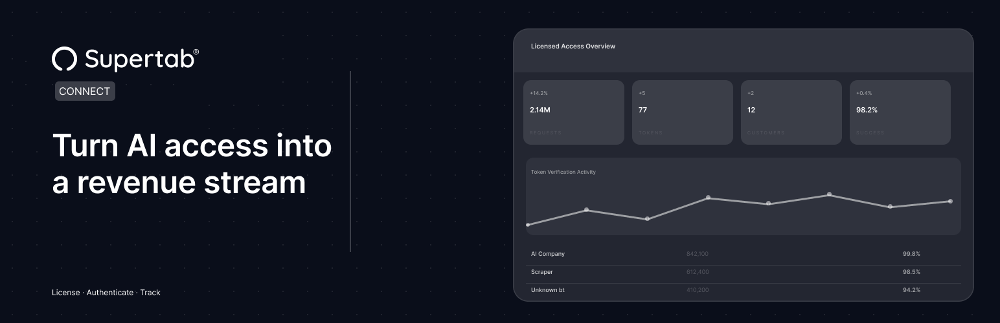

# Supertab Connect for WordPress

Connect your WordPress site to the Supertab Connect platform for RSL license serving and enabling crawler authentication protocol.

## Description

[Supertab Connect](https://www.supertab.co/supertab-connect) lets you define how AI systems and automated scrapers can access your content. You can define licensing terms, manage partner access, and track usage without building custom infrastructure.

Supertab Connect handles the underlying systems, including license servers, token management, and request verification, so you can focus on controlling who accesses your content and how it’s used. It provides two core capabilities:

### RSL License Serving

Automatically serves your site’s RSL license at /license.xml. The license is fetched from the Supertab Connect API and cached locally for performance, enabling crawlers and AI agents to discover your content’s licensing terms.

### Crawler Authentication Protocol (CAP)

Verify that connected partners are accessing your content present valid license tokens.

This allows you to:

* confirm which customers are accessing your content
* monitor usage against declared licensing terms
* control access for specific parts of your site

### How It Works

1. Enter your Website URN from the [Supertab Connect dashboard](https://merchant-connect.supertab.co/)
2. Your `license.xml` is immediately served at your site root
3. Optionally add your Merchant API Key to enable license verification
4. Configure which parts of your site require verification via the Crawler Authentication Protocol

### Features

* Automatically serves your license file at /license.xml
* Caches license XML locally for performance
* No infrastructure changes required
* Optional verification for connected partners via the Crawler Authentication Protocol
* Flexible control over which parts of your site are covered

## External Services

This plugin connects to the [Supertab Connect API](https://api-connect.supertab.co) to provide its functionality:

* **RSL License Serving** — Your Website URN is sent to retrieve your site's license XML file. This happens on every request to `/license.xml` (cached locally after first fetch).
* **Crawler Authentication Protocol** — When enabled by the site administrator, page URLs and user agent strings from bot requests are sent to verify license tokens and record usage events.

No personal data from your site visitors is collected or transmitted.
See the [Supertab Terms of Use and Privacy Policy](https://www.supertab.co/legal).

## Installation

1. Download the latest `supertab-connect.zip` from the [Releases](https://github.com/getsupertab/connect-wp/releases) page.
2. In WordPress, go to **Plugins → Add New → Upload Plugin**, choose the zip, and click **Install Now**. Alternatively, unzip it into `/wp-content/plugins/`.
3. Activate the plugin through the **Plugins** screen in WordPress.
4. Navigate to **Settings → Supertab Connect** to configure your Website URN.
5. (Optional) Enter your Merchant API Key and enable the Crawler Authentication Protocol.

You will need a Supertab Connect account. Visit [Supertab Connect](https://merchant-connect.supertab.co/) to get started.

## Frequently Asked Questions

### What is an RSL license?

An RSL is a machine-readable license file that declares how crawlers and AI agents may access your content. Serving it at /license.xml makes your licensing terms discoverable.

### What is the Crawler Authentication Protocol (CAP)?

CAP is a protocol that requires bots to present license tokens when accessing your content. This lets you verify that automated systems accessing your content are doing so under agreed terms. It allows you to track and manage access without changing your site infrastructure.

### Can I control which pages are protected by CAP?

Yes. When CAP is enabled, you can specify path patterns with wildcard support to control exactly which URLs require license token verification.

## Changelog

See the [Releases](https://github.com/getsupertab/connect-wp/releases) page for release notes and version history.

## License

Licensed under [GPL-2.0-or-later](https://www.gnu.org/licenses/gpl-2.0.html).
